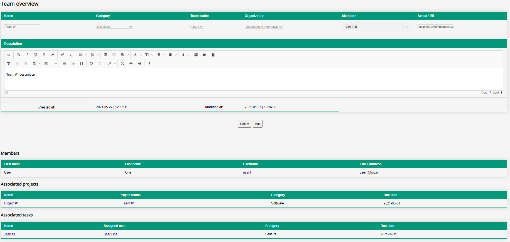
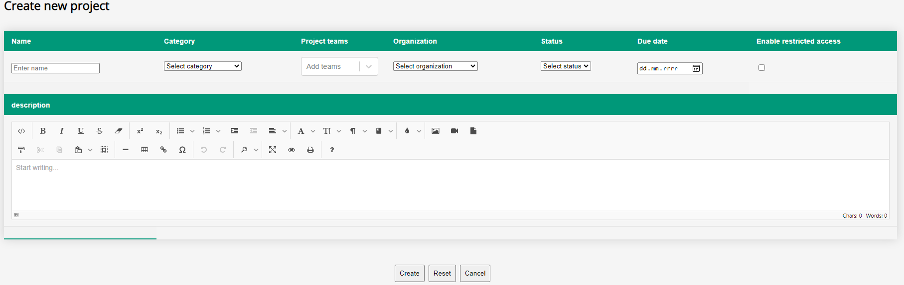

# Hermes
Project Management system written in MERN stack.  

## Table of contents
[Description](#description) 
[Features](#features) 
[Technology stack](#technology-stack) 
[Architecture](#architecture) 
[Project structure](#project-structure) 
[Security](#security) 
[User Interface examples](#user-interface-examples) 
[TODO](#todo) 
[Licence](#licence)  

## Description
Hermes is an open-source web application providing a set of tools designed to perform tasks in the Project Management field. Users can organize into companies, organizational units and teams in order to perform various tasks related to predefined projects.

One of the key features of Hermes is a complete isolation of company's workspace which allows its users to keep their confidential data safe. In other words, users can only access information related directly to their company/organizational unit/team.  

## Features
- re-create your company's structure in Hermes by organizing your employees into organizational units and teams
- create and manage your projects as well as their related tasks via simple, straightforward User Interface
- keep your company's data safe from unfair competition by isolating your workspace   

## Technology stack
Hermes was created in MERN stack which incorporates the following technologies:
- MongoDB
- ExpressJS
- React
- Node.js  

## Architecture
Hermes is a full-stack application consisting of separate client and server sub services. Communication between these services is provided by REST API implemented on backend and is actively used in various CRUD-related operations and is a core element of Token Based Authentication. 

  

  <em>Figure 1. Client-Server communication Flow within Hermes</em>

  

## Project structure
### Client
- `/public` - root directory for serving static content 
  - `/images` - directory for public images served by client application 
- `/src` - core directory in client project 
  - `/assets` - directory storing CSS stylesheets, custom scripts etc. 
    - `/css` - CSS styles directory 
  - `/components` - root directory of all React class based components 
  - `/middleware` - contains client-side handler for Token Based Authentication along with translation middleware responsible for managing `LocalStorage` 
  - `/services` - currently stores only `i18n` translation service 
  - `/translations` - root directory of translations 
    - `/pl` - Polish translation via `common.json` 
    - `/en` - English translation via `common.json`   

  

  <em>Figure 2. Component hierarchy in client app</em>

  

### Server
- `/public` - root directory for serving static content 
  - `/images` - directory for public images served by server application 
- `/src` - core directory in server project 
  - `/config` - currently stores only `Passport` config with definition of `Local`/`Jwt` strategies 
  - `/middleware` - contains authentication, data validation and error handlers 
  - `/models` - implements data models used by `mongoose` library 
  - `/routes` - root directory of REST API routes 
    - `/protected` - routes protected by authentication middleware 
    - `/public` - routes publicly accessible without authentication 
  - `/services` - root directory of services related to user registration and Atlas cloud 
    - `/db` - MongoDB transactional services   

## Security
Hermes uses a session-less, Token Based Authentication system. It consists of several aspects:
- it uses a pair of JWT tokens - `access` and `refresh`
- every route stored in `/routes/protected` directory has applied authentication middleware ensuring that user requesting specific resource is authenticated
- `LocalStrategy` handles Basic Auth employed in `/auth/login` route
- `JwtStrategy` handles access to restricted resources via Bearer Token
- Sensitive information like DB url, username or password are stored in environmental variables and are managed by `dotenv` library. For security reasons, `.env` file is disconnected from Git version control system.
- both in registration and authentication flow, password is encrypted by `bcrypt` library and its hash is stored in Atlas cloud.  

  

  <em>Figure 3. User Authentication Flow</em>

 

  

  <em>Figure 4. Access/Refresh token characteristics and differences</em>

   

## User Interface examples
<table>
  <tr>
    <td> <em>Figure 5. Dashboard view</em></td>
    <td> <em>Figure 6. Team overview</em></td>
  </tr>
  <tr>
    <td> <em>Figure 7. Create new project</em></td>
    <td> <em>Figure 8. Project overview</em></td>
  </tr>                                                                           
</table>  

## TODO

## Licensing
Hermes is being distributed under GPL-3.0 licence. 
https://www.gnu.org/licenses/gpl-3.0.html
